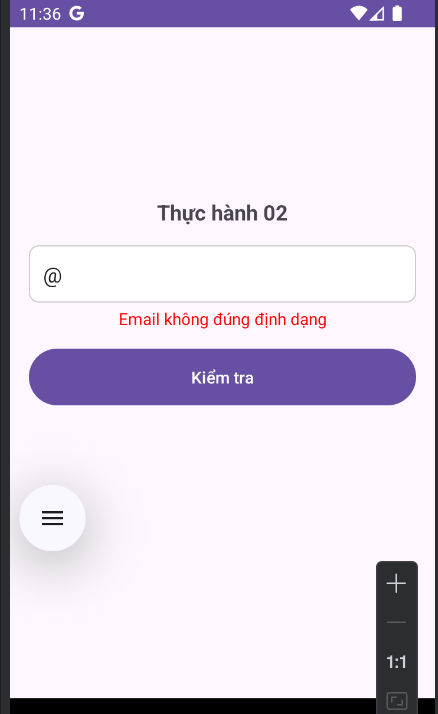

# CheckEmail_MobileDev_W2

## Thông tin sinh viên
- **Họ và tên:** Trịnh Đình Thành
- **Lớp:** CN22E
- **MSSV:** 2251120247
- **Email:** tdthanh.dev2025@gmail.com
- **SĐT:** 0397554756
- **Trường:** UTH - Đại Học GTVT Tp HCM

### Bố cục giao diện:

### Kiểm tra thành công:

### Một số trường hợp lỗi:
- 
- 
- 
- 
- 

## Công nghệ sử dụng
- Android Studio
- XML cho thiết kế giao diện
- ConstraintLayout để xây dựng bố cục linh hoạt
- Material Design cho các thành phần giao diện người dùng

## Cài đặt
1. Clone repository này về máy
2. Mở dự án trong Android Studio
3. Chạy ứng dụng trên thiết bị thật hoặc máy ảo

## Phiên bản
- Version 1.0 (Tuần 2)
